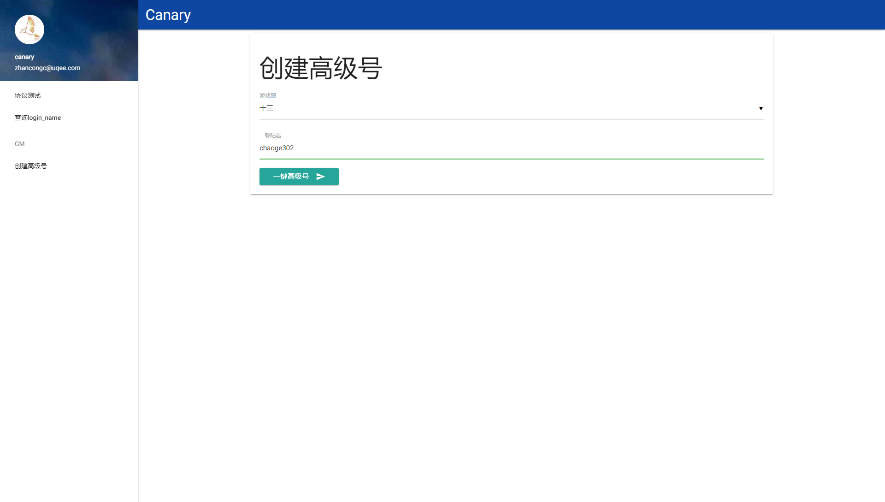

# canary 说明文档
---
> project_name  :   canary
>
> svn url       :   svn://10.0.253.72/canary
>
> author        :   zhancongc@icloud.com
>
> create_date   :   ‎2020‎/07‎/‎24‎ ‏0‎9:36:12
>
> description   :   基于protobuf协议的接口测试工具平台

[TOC]

## 1.准备Windows开发环境

### 1.1checkout项目

```shell
svn co svn://10.0.253.72/canary
```

### 1.2安装python2.7.13

安装software目录下python-2.7.18.amd64.msi

### 1.3安装python库

```shell
# 安装项目所需依赖
pip install -r app/requirments.txt -i https://pypi.douban.com/simple
```

### 1.4安装cygwin

```shell
# 下载地址
wget https://cygwin.com/setup-x86_64.exe

# 国内源
http://mirrors.aliyun.com/cygwin/

# 安装编译环境
gcc g++ autoconf automake 
```

### 1.5编译安装protobuf

```shell
# 安装protobuf
cp software/protobuf-2.3.0.tar.gz ./
tar -xzvf protobuf-2.3.0.tar.gz
cd protobuf-2.3.0
./configure --prefix=/usr/local/include --without-readline
make && make install

# 安装google-protobuf库
cd python
python setup.py install
```

### 1.6拉取protobufs

```shell
svn checkout http://10.0.0.21/svn/wly2_svn/静态数据/1.0.7/protobufs
```

### 1.7生成python对象

```shell
cd /protobufs
protoc --python_out=../protocol_py *
```

### 1.8生成对象字典

```shell
python app/utils/get_protocol_dict.py
```

## 2.接口测试

### 2.1 测试案例

测试用例都在testsuite目录下，利用pytest构建测试用例，引入robot对象实现协议的收发。

```python
# coding=utf-8
"""
filename: test_ChatMsg.py
author: zhancongc@icloud.com
description: 7801号协议的测试用例
"""


from app.single_client import Robot


class TestChat:
    protocol_type = 7801
    login_name = "fly150"
    server_id = 7
    robot = None

    def setup_class(self, method):
        self.robot = Robot(self.server_id, self.login_name)
        self.robot.start()

    def teardown_class(self, method):
        self.robot.stop()

    def test_chat_01(self):
        data = {"msg_type": 2, "zone_id": 0, "contact_player_name": "", "content": "Hello, world!",
             "content_type_num": 1, "to_role_id": 0}
        self.robot.send(self.protocol_type, data)
        res = self.robot.get_response()
        assert res[1].msg.role_id == int(self.robot.client.role_id)
```

### 2.2构造测试数据

需要写对应的脚本来造数据

### 2.3 利用Pytest实现自动化测试

参考测试案例和pytest文档

## 3. 工具平台

### 3.1 辅助脚本

理论上，所有功能都可以通过Robot和GameMaster来实现。

例如：一键高级号

```python
# coding=utf-8
"""
filename: create_superior_account.py
author: zhancongc@icloud.com
description: 创建高级号
"""
import sys
from app.utils.game_master import GameMaster
from app.single_client import Robot

try:
    server_id = 1002
    login_name = "fly150"
except IndexError as e:
    print(e)
    sys.exit(1)

# 创建并启动机器人
robot = Robot(server_id, login_name)
robot.start()
# 创建gm对象，并提升角色等级
gm = GameMaster(robot.client.server)
gm.superior_account(robot.client.role_id)
gm.close()
# 停止机器人
robot.stop()
```

### 3.2 web服务

目前只接了三个功能，功能待开发。


 

 

### 3.3 web服务部署

目前服务端部署在10.0.253.96

#### 3.3.1安装和配置uwsgi

```shell
yum install python-devel.x86_64
pip install uwsgi
```

/app/wly2_test_tool/app/canary_uwsgi.ini

```ini
[uwsgi]
# 使用nginx连接时使用socket通信
socket=127.0.0.1:4999
# 直接使用自带web server 使用http通信
# http=0.0.0.0:5000
# 指定项目目录
chdir=/app/wly_test_tool/app
# 指定python虚拟环境
# home=/usr/bin/python
# 指定加载的WSGI文件
wsgi-file=manage.py
# 指定uWSGI加载的模块中哪个变量将被调用
callable=app
# 设置工作进程的数量
processes=2
# 设置每个工作进程的线程数
threads=2
# 将主进程pid写到指定的文件
pidfile=%(chdir)/uwsgi.pid
# 日志文件
# daemonize = /var/log/canary/uwsgi.log
```

#### 3.3.2安装和配置supervisor

```shell
yum install supervisor
# 安装后默认启动
```

/etc/supervisor.d/canary.ini

```ini
[program:canary]
command=/usr/bin/uwsgi /app/wly_test_tool/app/canary_uwsgi.ini
user=root
autostart=true
autorestart=true
stdout_logfile=/var/log/canary/uwsgi_supervisor.log
stderr_logfile=/var/log/canary/uwsgi_supervisor_err.log
```

```shell
# 启动
supervisorctl start canary
# 查看状态
supervisorctl status
#重启
supervisorctl restart all
```

#### 3.3.3安装和配置nginx

```shell
yum install nginx
```

/etc/nginx/conf.d/canary.conf
```nginx
server {
        listen       5000;
        server_name  10.0.253.96;
        client_max_body_size 35m;
        gzip on;
        gzip_buffers 32 4K;
        gzip_comp_level 6;
        gzip_min_length 4000;
        gzip_types text/plain application/json application/javascript application/x-javascript application/css application/xml application/xml+rss text/javascript application/x-httpd-php image/jpeg image/gif image/png image/x-ms-bmp;
 
        location / {            
            include  uwsgi_params;
            uwsgi_pass  127.0.0.1:4999;
            uwsgi_ignore_client_abort on;
            # uwsgi_param UWSGI_SCRIPT demosite.wsgi;  //入口文件，即wsgi.py相对于项目根目录的位置，“.”相当于一层目录
            # uwsgi_param UWSGI_CHDIR /demosite;       //项目根目录
            # index  index.html index.htm;
        }
}
```

#### 3.3.4开启防火墙

```shell
# 检查
ps aux|grep nginx
netstat -ntlp
# 开启防火墙
firewall-cmd --zone=public --add-port=80/tcp --permanent
systemctl restart firewalld.service
```
## 4.并发测试

并发测试需要自己写handler来实现robot的行为，具体参考multiple_client.py

## 5. redis数据库

redis数据库的数据查询和修改工具

## 6. 日志监控

生产环境的服务端日志监控

